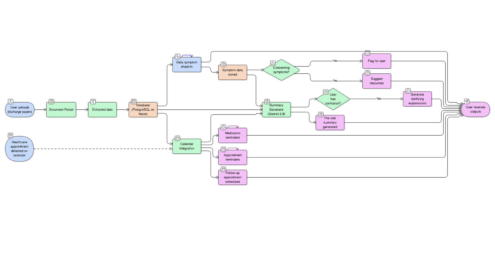
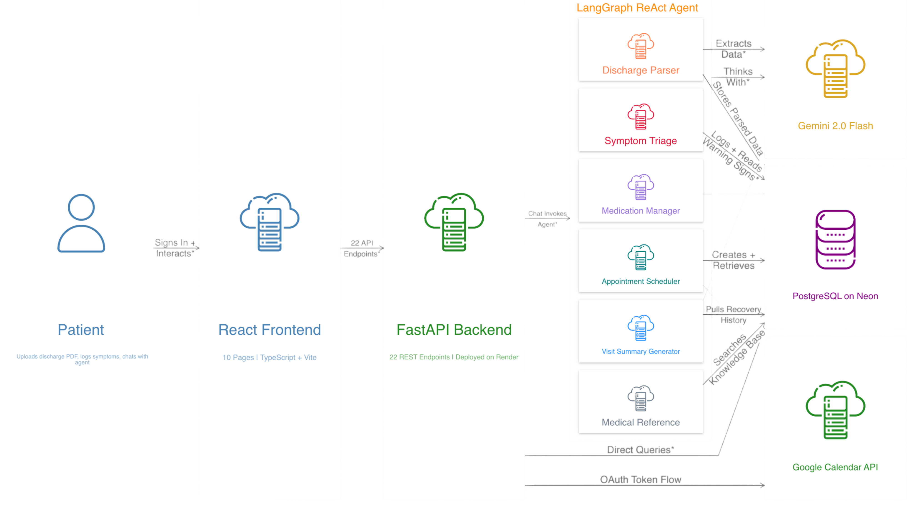

# CareCompanion

**Break Through Tech x Agentic AI Specialization | Spring AI Studio 2026**

**Healthcare Team 1**

---

## What is CareCompanion?

When you leave the hospital after a surgery or serious illness, you get handed a stack of discharge papers full of medications, follow-up dates, and warning signs. Most people lose track of all of it within days. CareCompanion fixes that.

It's a full-stack web app where you upload your discharge PDF, and an AI agent automatically extracts your medications, appointments, and care instructions. From there, you talk to the agent and it actually does things: logs your symptoms, checks for emergencies based on your specific condition, looks up your meds, schedules appointments, syncs reminders to your Google Calendar, and generates a summary you can hand your doctor at your next visit.

This is not a chatbot. It's a conversational agent with 11 specialized tools that takes actions on your data.

---

## System Architecture

### Where We Started



This was our first pass at the architecture. It mapped out the general idea: patient uploads papers, data gets parsed, symptoms get flagged, summaries get generated, calendar gets synced. It helped us align on what we were building, but it treated everything as separate pipelines running in parallel. The triage logic was a single yes/no decision, the agent itself wasn't represented anywhere, and the calendar flow was pointing in the wrong direction (reading from Google Calendar instead of writing to it).

### What We Actually Built



The real architecture runs everything through a single **LangGraph ReAct agent** that decides which tools to call on every message. The agent reasons with **Gemini 2.0 Flash** and picks from 11 tools depending on what you need. There's no fixed pipeline. The agent dynamically selects tools based on context. Symptom triage went from a binary flag to three distinct severity tiers. The calendar integration writes outward to Google Calendar, not the other way around. And every tool that was missing from the original sketch (medication info lookup, trend analysis, discharge PDF RAG, medical reference) is accounted for here.

**Tech Stack:**

- **Frontend:** React + TypeScript + Vite (10 pages)
- **Backend:** FastAPI with 22 REST endpoints, deployed on Render
- **AI Agent:** LangGraph ReAct pattern with 11 tools, powered by Gemini 2.0 Flash
- **Database:** PostgreSQL on Neon (9 tables, SSL encrypted)
- **Calendar:** Google Calendar API via OAuth 2.0

---

## Agent Tools

| Tool | What It Does |
|------|-------------|
| Discharge Parser | Takes your PDF, extracts meds, appointments, and instructions as structured JSON, stores it all in the database |
| Symptom Triage | Logs symptoms and checks them against condition-specific warning signs with three severity tiers: emergency (call 911), urgent (call doctor today), monitor (recheck in 4-6 hours) |
| Symptom Trend Analysis | Tracks your symptoms over time and flags whether things are improving, worsening, or stable |
| Medication Manager | Builds your daily med schedule, tracks adherence, and creates Google Calendar reminders |
| Medication Info Lookup | Pulls from a 16-drug reference database with purpose, side effects, warnings, and food instructions |
| Appointment Scheduler | Parses natural language dates and creates appointments in the database |
| Visit Summary Generator | Synthesizes your symptoms, meds, and appointments into a doctor-visit prep report using Gemini |
| Discharge Instructions Retrieval | Pulls your stored discharge instructions from the database |
| Discharge PDF RAG | Answers specific questions about your discharge papers using the PDF as context |
| Medical Reference | Searches the warning signs and medication knowledge base |
| Google Calendar Sync | Pushes recurring medication reminders and appointment events to your calendar via OAuth |

---

## Symptom Triage Logic

The agent checks logged symptoms against hardcoded warning signs for 7 condition types:

| Condition | Emergency (Call 911) | Urgent (Call Doctor) | Monitor (Recheck) |
|-----------|---------------------|---------------------|-------------------|
| Cardiac Surgery | Severe chest pain, breathing difficulty, fainting | Fever above 100.4, red/swollen incision | Mild soreness, fatigue |
| Joint Replacement | Sudden severe leg pain, chest pain | Fever, drainage from incision | Pain/swelling, bruising |
| Abdominal Surgery | Severe worsening pain, vomiting blood | Opening incision, spreading redness | Gas/bloating, constipation |
| Heart Failure | Severe shortness of breath, chest pain | Weight gain 2-3 lbs/day, increased swelling | Some shortness of breath with activity |
| Pneumonia | Severe breathing difficulty, confusion | Returning fever, worsening cough | Gradual cough improvement |
| Stroke | New weakness one side, speech difficulty | Persistent dizziness | Fatigue, emotional changes |
| General Surgery | Severe unrelieved pain, heavy bleeding | Fever, pus from incision | Mild pain, bruising |

---

## Project Structure

```
care-companion/
├── app/
│   ├── static/assets/          # Built frontend files
│   ├── __init__.py
│   ├── agent.py                # LangGraph ReAct agent + 11 tools (889 lines)
│   └── main.py                 # FastAPI backend + 22 endpoints (704 lines)
├── frontend/
│   └── src/
│       ├── api/                # API client functions
│       ├── components/         # Reusable UI components
│       ├── context/            # Auth + Chat state management
│       ├── hooks/              # Custom React hooks
│       ├── lib/                # Warning signs data
│       └── pages/              # 10 page components
├── figures/
│   ├── Healthcare-Scheduler-Agent-Flowchart.png  # Initial architecture
│   └── finalized_CC_flowchart.png                # Final architecture
├── requirements.txt
└── README.md
```

---

## Running It Locally

**Backend:**

```bash
pip install -r requirements.txt
```

Set your environment variables:

```
GOOGLE_API_KEY=your_gemini_api_key
DB_HOST=your_neon_host
DB_NAME=your_db_name
DB_USER=your_db_user
DB_PASSWORD=your_db_password
DB_PORT=5432
GOOGLE_CLIENT_ID=your_google_oauth_client_id
GOOGLE_CLIENT_SECRET=your_google_oauth_client_secret
```

```bash
uvicorn app.main:app --reload
```

**Frontend:**

```bash
cd frontend
npm install
npm run dev
```

---

## Live Deployment

The app is deployed on Render at [care-companion-kzf0.onrender.com](https://care-companion-kzf0.onrender.com/dashboard).

---

## Team

| Name | Role | GitHub |
|------|------|--------|
| Basir Abdul Samad | Environment/Code Manager | [@BasirS](https://github.com/BasirS) |
| Amal Bilal | Data Manager | [@AmalBilal1](https://github.com/AmalBilal1) |
| Michelle Rahman | User Management | [@michelle-rahman](https://github.com/michelle-rahman) |
| Samikha Srinivasan | Team Manager | [@SamikhaS-rgb](https://github.com/SamikhaS-rgb) |

**Coach:** Beth

---

## License

MIT
